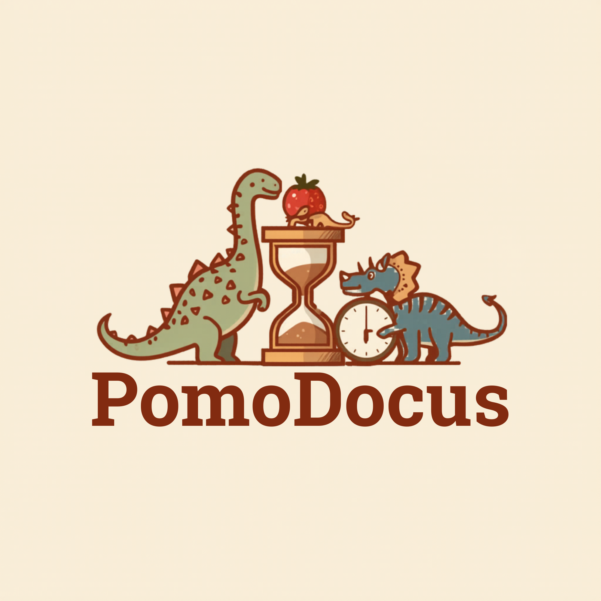

# 🍅 Pomodocus

<div align="center">
  
  <br><br>
  
  
  
  
</div>

<br>

**Pomodocus** est une application gamifiée de **Pomodoro** avec des dinosaures collectibles ! Restez productif tout en collectionnant des dinosaures adorables.

---

## ✨ Fonctionnalités

- ⏱️ **Timer Pomodoro** — Sessions de travail et pauses configurables
- 🦕 **Dinosaures collectibles** — Débloquez des dinosaures en restant productif
- 🎮 **Gamification** — Système de points et de niveaux
- 📊 **Statistiques** — Suivi de votre productivité
- 🎨 **Thèmes** — Personnalisation de l'apparence
- 🔔 **Notifications** — Rappels pour les pauses
- 💾 **Sauvegarde** — Données persistantes dans le localStorage

---

## 🚀 Installation

### Prérequis

- Node.js 18 ou supérieur
- npm, yarn ou pnpm

### Développement

```bash
# Cloner le repository
git clone https://github.com/lucasskvn/Pomodocus.git
cd Pomodocus

# Installer les dépendances
npm install

# Lancer le serveur de développement
npm run dev

# Ouvrir http://localhost:5173
```

### Production

```bash
# Build pour la production
npm run build

# Preview du build
npm run preview
```

---

## 📁 Structure

```
Pomodocus/
├── public/
│   └── sprites/
│       └── ui/           # Images des dinosaures
├── src/
│   ├── components/        # Composants React
│   ├── hooks/             # Hooks personnalisés
│   ├── store/             # State management
│   ├── utils/             # Utilitaires
│   ├── App.tsx            # Composant principal
│   └── main.tsx           # Point d'entrée
├── index.html
├── package.json
├── tsconfig.json
├── vite.config.ts
├── tailwind.config.js
└── postcss.config.js
```

---

## 🎮 Comment jouer

1. **Lancez un timer** — Cliquez sur le bouton "Start"
2. **Travaillez** — Concentrez-vous pendant 25 minutes (configurable)
3. **Pause** — Prenez une pause de 5 minutes
4. **Collectionnez** — Gagnez des points et débloquez des dinosaures
5. **Répétez** — Continuez pour augmenter votre collection !

---

## 🦕 Dinosaures

Collectionnez différents dinosaures en atteignant des objectifs :

| Dinos | Condition |
|:------|:----------|
| 🦕 Brachiosaure | Premier timer complété |
| 🦖 T-Rex | 5 timers complétés |
| 🦎 Tricératops | 10 timers complétés |
| 🐉 Ptérodactyle | 25 timers complétés |
| 🦕 Diplodocus | 50 timers complétés |

---

## ⚙️ Configuration

Modifiez les paramètres dans l'application :

- **Durée du timer** — 15, 25, 30, 45, 60 minutes
- **Durée de la pause** — 5, 10, 15 minutes
- **Thème** — Clair, Sombre, Auto
- **Notifications** — Activées/Désactivées

---

## 🛠️ Technologies

- **React 18** — Bibliothèque UI
- **TypeScript** — Typage statique
- **Vite** — Build tool rapide
- **Tailwind CSS** — Framework CSS utilitaire
- **Zustand** — State management
- **Framer Motion** — Animations

---

## 🤝 Contribuer

Les contributions sont les bienvenues ! Pour contribuer :

1. Fork le projet
2. Créer une branche feature (`git checkout -b feature/AmazingFeature`)
3. Commit les changements (`git commit -m 'Add AmazingFeature'`)
4. Push sur la branche (`git push origin feature/AmazingFeature`)
5. Ouvrir une Pull Request

---

## 📝 License

Ce projet est sous licence MIT. Voir le fichier [LICENSE](LICENSE) pour plus de détails.

---

## 👤 Auteur

**Lucas Kvn** — [GitHub](https://github.com/lucasskvn) — [lucasskvn.fr](https://lucasskvn.fr)

---

<div align="center">
  <sub>🍅 Fait avec React et ☕</sub>
</div>
